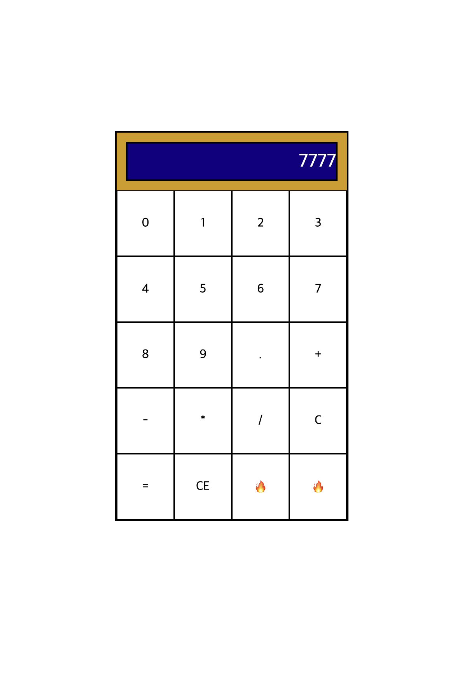

# 🧮 계산기 (Calculator)

## 📌 프로젝트 소개

순수 JavaScript, HTML, CSS로 만든 웹 계산기입니다. The Odin Project Foundations 코스의 마무리 프로젝트로, 그동안 학습한 자바스크립트 기초를 종합적으로 활용했습니다. 커리큘럼 지침에 따라 보안상 위험한 `eval()`과 `new Function()`은 사용하지 않았습니다.

## 🔗 데모

[여기서 직접 써보기](https://jhoncarmack.github.io/Calculator/)

## 📸 스크린샷



## 🎯 이 프로젝트로 입증하는 역량

- **프레임워크 없는 상태 관리** — 입력 단계를 추적하는 플래그(`keepAppending`, `isFirstOperator`, `justCalculated`, `isWorking`)를 직접 설계해 계산 흐름을 제어
- **DOM 조작 및 이벤트 처리** — 반복문으로 버튼을 동적 생성하고 클릭/키보드 이벤트로 입력을 처리
- **체계적인 디버깅** — 버그를 직접 재현하고 코드 흐름을 한 단계씩 추적해 원인을 규명한 뒤 수정
- **엣지 케이스 처리** — 0으로 나누기, 연산자 연속 입력, 값 미입력 시 `=` 입력 등 예외 상황을 방어
- **리팩터링** — 중복 로직을 함수로 통합(`round`, 연산자 처리)하고 early return으로 분기를 단순화
- **키보드 입력 지원** — 키 이벤트를 버튼 동작에 매핑해 마우스 없이도 조작 가능

## ✨ 기능 (Features)

- [x] `add`, `subtract`, `multiply`, `divide` 함수
- [x] `operate` 함수 (연산자와 두 숫자를 받아 알맞은 함수 호출)
- [x] 숫자·연산자 버튼 UI
- [x] 디스플레이(결과 화면)
- [x] clear 버튼 (초기화)
- [x] 한 번에 한 쌍만 계산 (예: 12 + 7 - 1)
- [x] 긴 소수 결과 반올림 (디스플레이 넘침 방지)
- [x] 0으로 나누기 처리 (에러 메시지)
- [x] 연산자 연속 입력 처리
- [x] 결과 표시 후 새 숫자 입력 시 새 계산 시작

### 🌟 추가 기능 (Extra Credit)

- [x] 소수점(`.`) 입력 (중복 입력 방지)
- [x] backspace 버튼
- [x] 키보드 지원

## 🛠 사용 기술

- **HTML5** — 구조 및 마크업
- **CSS3** — 스타일링 및 레이아웃
- **JavaScript (ES6+)** — 계산기 로직

## 📂 파일 구조

```
calculator/
├── index.html    # 마크업 및 계산기 레이아웃
├── style.css     # 스타일
├── script.js     # 계산기 로직
└── README.md
```

## 🚀 시작하기

1. 저장소를 클론합니다
   ```bash
      git clone https://github.com/jhoncarmack/Calculator.git
   ```
2. `index.html`을 브라우저에서 엽니다

## 🔧 아쉬운 점 & 향후 보완

기능은 모두 동작하지만, 시간 관계상 미뤄둔 개선 사항들입니다. 천천히 보완해갈 예정입니다.

- **디스플레이 2단 분리** — 현재는 한 줄로 입력과 결과를 함께 보여줍니다. 입력 수식(`12 + 7`)과 결과(`19`)를 위아래로 나누면 UX가 더 좋아집니다.
- **CSS 디자인 다듬기** — 색상, 버튼 스타일, 반응형 등 시각적 완성도를 더 높일 수 있습니다.
- **빈 버튼 칸 활용** — 4×5 격자 중 2칸이 비어 있어, `±`(부호 전환)나 `%` 같은 기능을 추가할 여지가 있습니다.
- **네이밍·구조 정리** — 일부 변수·클래스 이름과 분기 구조를 더 다듬을 수 있습니다.

## 🤖 AI 활용 방식

이 프로젝트의 핵심 로직은 직접 작성했으며, AI는 다음과 같은 방식으로만 활용했습니다.

프로젝트를 진행하며 발상·원리·방향에서 막힐 때, 먼저 스스로 할 수 있는 시도를 모두 해본 뒤 어디서 막혔는지가 분명해지면 그 지점을 구체적으로 질문했습니다. 이때 정답 코드를 받기보다는 **방향과 힌트만** 제시받아 직접 해결하는 방식을 택했습니다. 덕분에 상태 관리, 연속 계산, 예외 처리 같은 어려운 부분도 스스로 디버깅하며 원리를 체득할 수 있었습니다.

## 🙏 감사의 말

[The Odin Project](https://www.theodinproject.com/) Foundations 커리큘럼의 일부로 제작되었습니다.
